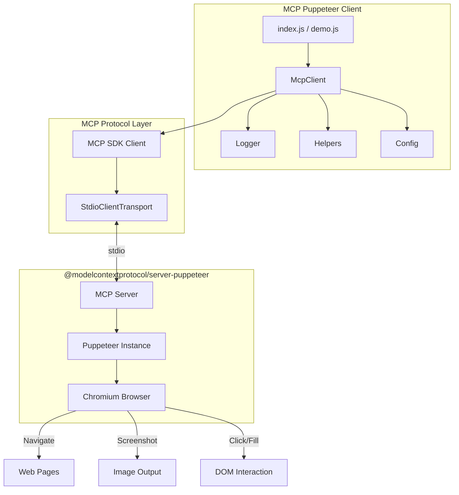
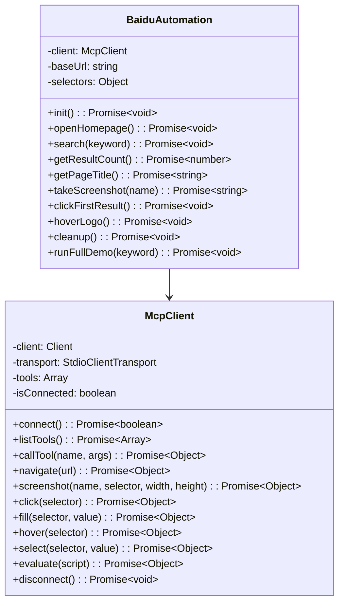
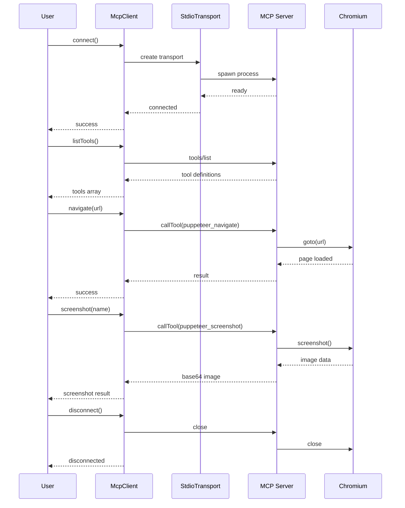

# MCP Puppeteer Client - 项目设计文档

## 1. 系统架构



## 2. 模块设计

### 2.1 核心模块

| 模块      | 文件                      | 职责                       |
| --------- | ------------------------- | -------------------------- |
| McpClient | `src/client/McpClient.js` | MCP 连接管理、工具调用封装 |
| Config    | `src/config/index.js`     | 配置管理                   |
| Logger    | `src/utils/logger.js`     | 日志记录                   |
| Helpers   | `src/utils/helpers.js`    | 辅助工具函数               |

### 2.2 示例模块

| 模块               | 文件                                  | 职责           |
| ------------------ | ------------------------------------- | -------------- |
| Demo               | `src/demo.js`                         | 完整演示流程   |
| BaiduAutomation    | `src/examples/baidu-automation.js`    | 百度搜索自动化 |
| AdvancedOperations | `src/examples/advanced-operations.js` | 高级操作示例   |

## 3. 类图



## 4. 数据流



## 5. 可用工具列表

| 工具名称               | 描述            | 参数                                                               |
| ---------------------- | --------------- | ------------------------------------------------------------------ |
| `puppeteer_navigate`   | 导航到 URL      | `url: string`                                                      |
| `puppeteer_screenshot` | 截取截图        | `name: string, selector?: string, width?: number, height?: number` |
| `puppeteer_click`      | 点击元素        | `selector: string`                                                 |
| `puppeteer_fill`       | 填充输入框      | `selector: string, value: string`                                  |
| `puppeteer_hover`      | 悬停在元素上    | `selector: string`                                                 |
| `puppeteer_select`     | 选择下拉选项    | `selector: string, value: string`                                  |
| `puppeteer_evaluate`   | 执行 JavaScript | `script: string`                                                   |

## 6. 配置项

```javascript
{
  mcp: {
    serverCommand: 'npx',
    serverArgs: ['-y', '@modelcontextprotocol/server-puppeteer'],
    connectionTimeout: 30000,
    requestTimeout: 60000,
  },
  puppeteer: {
    headless: true,
    defaultViewport: { width: 1920, height: 1080 },
  },
  screenshot: {
    outputDir: './screenshots',
    format: 'png',
    quality: 90,
  },
  logging: {
    level: 'info',
    format: 'combined',
    outputDir: './logs',
  }
}
```

## 7. 错误处理

- 连接失败：自动重试或抛出异常
- 工具调用失败：记录日志并返回错误信息
- 截图保存失败：确保目录存在，记录错误

## 8. 日志规范

- INFO: 正常操作流程
- WARN: 非致命错误
- ERROR: 致命错误
- DEBUG: 调试信息

日志格式：`[YYYY-MM-DD HH:mm:ss] [LEVEL]: message`
